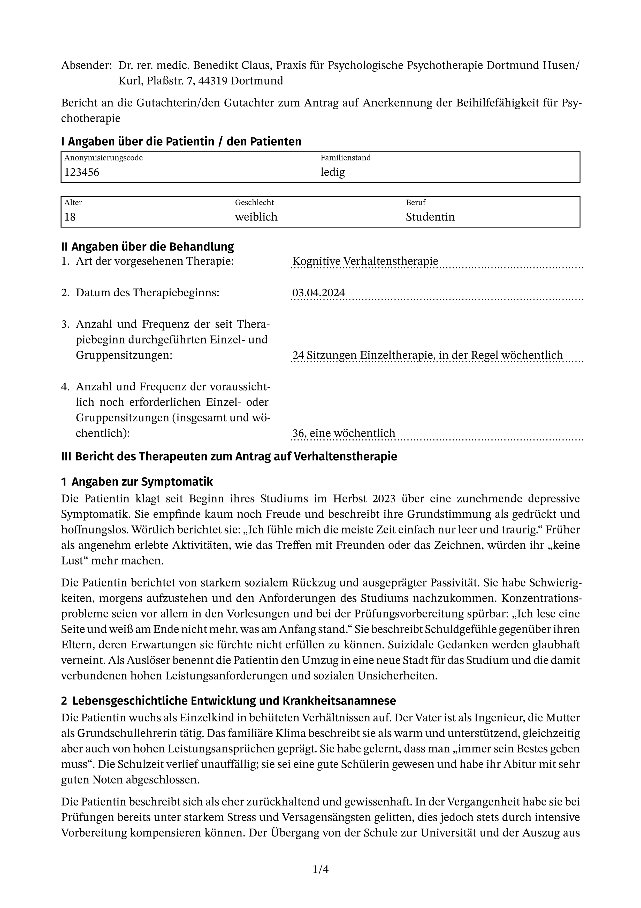
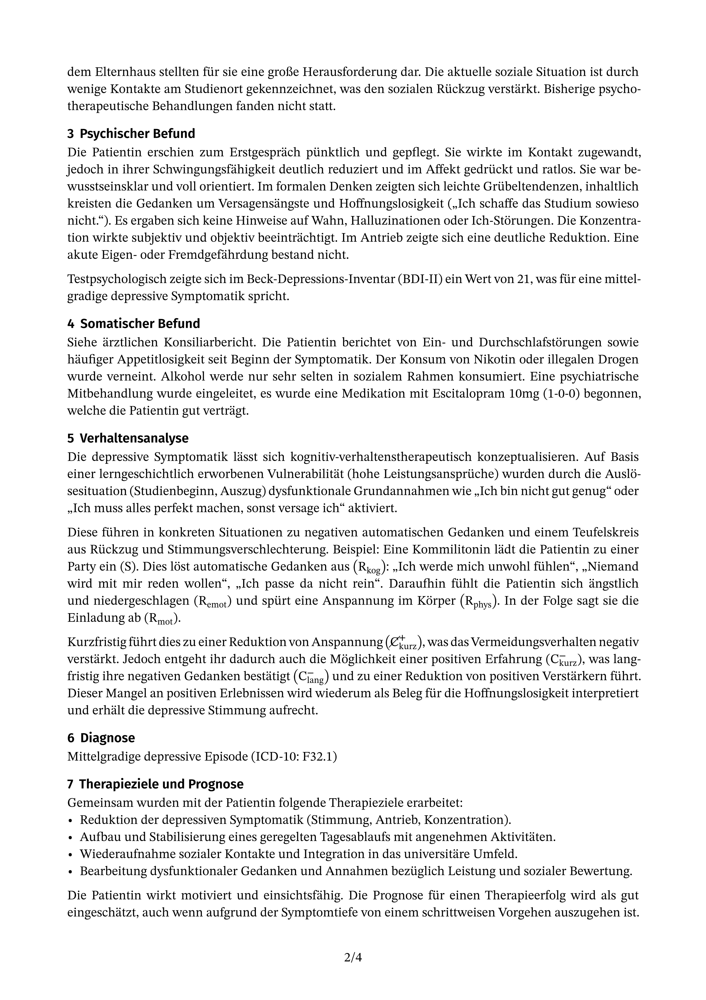

# typst Report Template for German Psychotherapy (PKV)

[](LICENSE)

A typst template for creating psychotherapy reports for German private health insurance providers (PKV) and Beihilfe. This template automates the layout and formatting, allowing you to focus on the content.

## Preview

The template generates a clean, multi-page report. Here is a sample of the first two pages:

| Page 1 | Page 2 |
| :---: | :---: |
|  |  |

## Features

* **Pre-defined Layout:** Automatically formats patient data, report sections, and page numbers.
* **Structured Content:** Clear separation between patient information and the main report body.
* **Easy Configuration:** Pass patient data and other variables directly to the template function.
* **Symbol Integration:** Designed to work with the [`psymbols`](https://github.com/benediktclaus/psymbols) package for easy microanalysis notation.

## Installation

This template requires a few dependencies to be installed manually to work as intended.

### Step 1: Install Required Fonts

This template is designed to use specific fonts for optimal appearance. Please download and install them on your system:

* **[STIX Two Text](https://fonts.google.com/specimen/STIX+Two+Text):** Used for body text and mathematical notation.
* **[Fira Sans](https://fonts.google.com/specimen/Fira+Sans):** Used for headings and other UI elements.

### Step 2: Install `psymbols` Package

This template requires the `psymbols` package for microanalysis symbols. Install it first by following its [local installation guide](https://github.com/benediktclaus/psymbols#installation-local-setup).

### Step 3: Install This Template

1.  **Download the Repository:** Clone or download this repository as a ZIP file and extract it.
2.  **Find Your Local typst Package Directory:** You need to find the standard package directory for your operating system.
    * **Windows:** `%APPDATA%\typst\packages\` (e.g., `C:\Users\<YourName>\AppData\Roaming\typst\packages`)
    * **macOS:** `~/Library/Application Support/typst/packages/`
    * **Linux:** `~/.local/share/typst/packages/`
3.  **Move the Package Files:** Create the following folder structure inside your `packages` directory and move the downloaded files into it.
    `.../packages/local/pkv-report/0.4.0/`
    Inside this `0.4.0` folder, you should place the `typst.toml`, `lib.typ`, and the `template` folder.

## Usage

To use the template, import it at the top of your `.typ` file and call the `pkvbericht` function within a `#show` rule. You pass all patient data and settings as arguments.

```typst
// Import the report template and the symbol package
#import "@local/pkv-report:0.4.0": *
#import "@local/psymbols:0.1.0" as psy

// Define variables for clarity
#let therapiebeginn = [03.04.2024]
#let sitzungen-bisher = 24

// Apply the template with all necessary parameters
#show: pkvbericht.with(
  code: [123456],
  familienstand: [ledig],
  alter: [18],
  geschlecht: [weiblich],
  beruf: [Studentin],
  therapiebeginn: therapiebeginn,
  anzahl-frequenz-bisher: [#sitzungen-bisher Sitzungen Einzeltherapie, in der Regel wöchentlich],
  anzahl-frequenz: [36, eine wöchentlich],
  datum: [11.11.2025]
)

// The rest of the document is your report content
= Bericht des Therapeuten zum Antrag auf Verhaltenstherapie
== Angaben zur Symptomatik
Die Patientin klagt seit Beginn ihres Studiums...

// Use symbols from the psymbols package where needed
... lädt die Patientin zu einer Party ein #psy.s. Dies löst ...
```

## Parameters

The `pkvbericht.with()` function accepts the following parameters:

| Parameter                | Type    | Description                                                              |
| :----------------------- | :------ | :----------------------------------------------------------------------- |
| `code`                   | Content | The anonymization code provided by the insurance/Beihilfe.               |
| `familienstand`          | Content | The patient's marital status (e.g., "ledig", "verheiratet").             |
| `alter`                  | Content | The patient's age.                                                       |
| `geschlecht`             | Content | The patient's gender (e.g., "weiblich", "männlich").                     |
| `beruf`                  | Content | The patient's profession.                                                |
| `therapiebeginn`         | Content | The date when the therapy started.                                       |
| `anzahl-frequenz-bisher` | Content | A description of the sessions already conducted (number and frequency).  |
| `anzahl-frequenz`        | Content | The number and frequency of sessions being applied for in this report.   |
| `datum`                  | Content | The date the report is being written.                                    |

## License

This project is licensed under the **MIT License**. See the `LICENSE` file for details.